# Document delivery & signer-auth architecture

Living diagram of how SignedBy stores, serves, and gates access to documents — the same
system covered in `DOCUMENT_DELIVERY_SECURITY_AUDIT.md` (2026-07-25 audit: found + fixed
the per-recipient OTP bypass, added R2 read retries). Node labels are real file paths on
purpose, so this stays a map of the actual code, not a conceptual sketch.

**Keep this updated**: whenever a file below is added, renamed, or its role changes (a new
signer-facing route, a different storage provider, a new auth mechanism), update the
diagram in the same change — ask Claude to "update DOCUMENT_ARCHITECTURE.md for this
change" and it'll edit the Mermaid source below. This renders automatically in GitHub's
file viewer; no image to regenerate.

```mermaid
flowchart TD
    subgraph SignerBrowser["Signer's browser"]
        SB1["GET /sign/{token}"]
        SV["signing-view.tsx<br/>fetches PDF via pdfjs-dist"]
    end

    subgraph SenderBrowser["Sender's browser (dashboard)"]
        NDC["new-document-client.tsx<br/>new document upload"]
        DOCVIEW["Document views<br/>field-editor.tsx, etc."]
    end

    subgraph NextApp["Next.js API routes (Vercel)"]
        PAGE["app/sign/[token]/page.tsx"]
        GATE["signer-auth-gate.tsx<br/>Confirm it's you"]
        AUTHREQ["api/sign/[token]/auth/request"]
        AUTHVER["api/sign/[token]/auth/verify"]
        SIGNLIB["lib/signing.ts<br/>getSignerByToken<br/>requireVerifiedSigner"]

        subgraph SignerRoutes["Signer-facing data routes (all call requireVerifiedSigner)"]
            FILER["file/route.ts"]
            SIGNEDFR["signed-file/route.ts"]
            SUMR["summary/route.ts"]
            SUBR["submit/route.ts"]
            DECR["decline/route.ts"]
            STATR["status/route.ts"]
            PAYR["payment-click/route.ts"]
            PVR["view/route.ts (dwell-time)"]
            VIEWR["route.ts (fields+doc)"]
            CLIENTERR["client-error/route.ts"]
        end

        UPURL["api/documents/upload-url/route.ts"]
        ORGFILE["api/documents/[id]/file, signed-file, original-file"]
        R2LIB["lib/r2.ts<br/>uploadToR2 / getSignedUploadUrl<br/>getFromR2 (3x retry-with-backoff,<br/>8s read timeout)"]
        TIMEOUTLIB["lib/with-timeout.ts<br/>shared timeout-race helper"]
    end

    subgraph Supa["Supabase"]
        ADMIN["Service-role admin client<br/>token-scoped, bypasses RLS"]
        RLS["Session client + RLS<br/>org-membership scoped"]
    end

    subgraph R2["Cloudflare R2 (S3-compatible endpoint, account creds)"]
        BUCKET["R2 bucket"]
    end

    SB1 --> PAGE
    PAGE --> SIGNLIB
    SIGNLIB --> ADMIN
    PAGE -- "auth_required and not verified" --> GATE
    GATE -- "request code" --> AUTHREQ
    AUTHREQ --> SIGNLIB
    GATE -- "verify code" --> AUTHVER
    AUTHVER --> SIGNLIB
    PAGE -- "verified or not required" --> SV

    SV -- "GET" --> FILER
    SV -- "GET" --> SIGNEDFR
    SV -- "GET" --> SUMR
    SV -- "GET" --> STATR
    SV -- "GET" --> VIEWR
    SV -- "POST" --> SUBR
    SV -- "POST" --> DECR
    SV -- "POST" --> PAYR
    SV -- "POST" --> PVR
    SV -- "POST, only after giving up" --> CLIENTERR

    FILER --> SIGNLIB
    SIGNEDFR --> SIGNLIB
    SUMR --> SIGNLIB
    SUBR --> SIGNLIB
    DECR --> SIGNLIB
    STATR --> SIGNLIB
    PAYR --> SIGNLIB
    PVR --> SIGNLIB
    VIEWR --> SIGNLIB
    CLIENTERR --> SIGNLIB
    CLIENTERR --> ADMIN

    SV -- "bounds the whole load" --> TIMEOUTLIB
    R2LIB -- "bounds each read attempt" --> TIMEOUTLIB

    FILER --> R2LIB
    SIGNEDFR --> R2LIB
    R2LIB --> BUCKET

    NDC -- "1. POST upload-url" --> UPURL
    UPURL --> R2LIB
    UPURL -- "2. presigned PUT URL" --> NDC
    NDC -- "3. PUT file directly, only browser-to-R2 call" --> BUCKET

    DOCVIEW --> ORGFILE
    ORGFILE --> RLS
    ORGFILE --> R2LIB
```

## Legend / what each piece is responsible for

| Node | File(s) | Responsibility |
|---|---|---|
| `page.tsx` | `src/app/sign/[token]/page.tsx` | Entry point for a signing link. Resolves the signer via `getSignerByToken`, renders the OTP gate, a dead-end status screen, or the signing UI. |
| `signer-auth-gate.tsx` | `src/components/signer-auth-gate.tsx` | The "Confirm it's you" code-entry screen, shown only when `auth_required && !auth_verified_at`. |
| `lib/signing.ts` | `src/lib/signing.ts` | `getSignerByToken()` (token → signer/document, admin client). `requireVerifiedSigner()` — the shared gate added 2026-07-25; every signer-facing data route must call this right after `getSignerByToken()`. |
| Signer-facing data routes | `src/app/api/sign/[token]/{route,file,signed-file,summary,submit,decline,status,payment-click,view,client-error}/route.ts` | Everything the signing UI calls once rendered — reading fields, streaming the PDF, signing, declining, polling status, and (since 2026-07-25) reporting a client-side load failure. All gated by `requireVerifiedSigner`. |
| `auth/request`, `auth/verify` | `src/app/api/sign/[token]/auth/{request,verify}/route.ts` | The two routes that must work **before** verification — they're how a signer becomes verified. Deliberately not gated by `requireVerifiedSigner`. |
| `lib/r2.ts` | `src/lib/r2.ts` | All Cloudflare R2 access: `getSignedUploadUrl` (presigned PUT, the only browser↔R2 call), `getFromR2` (server-side `GetObjectCommand`, retries transient failures up to 3x, 8s read timeout per attempt since 2026-07-25), `uploadToR2`/`deleteFromR2`/`copyInR2`. |
| `lib/with-timeout.ts` | `src/lib/with-timeout.ts` | Shared promise-vs-timer race, added 2026-07-25. Bounds `getFromR2`'s per-attempt read (server-side) and `signing-view.tsx`'s whole PDF load (client-side) so a stalled-but-not-erroring connection still fails and surfaces the existing retry/error UI, instead of hanging indefinitely. |
| `client-error/route.ts` | `src/app/api/sign/[token]/client-error/route.ts` | Best-effort beacon (2026-07-25): `signing-view.tsx` POSTs here once it's given up on loading the PDF, logging an `audit_events` row (`client_load_error`, migration 0034) so a load failure is queryable instead of only ever visible in the signer's own browser console. |
| `upload-url/route.ts` | `src/app/api/documents/upload-url/route.ts` | Issues the presigned PUT URL for a new upload (org-authenticated, rate-limited, plan-capped). |
| Org-side file routes | `src/app/api/documents/[id]/{file,signed-file,original-file}/route.ts` | Same proxy pattern as the signer routes, but access is scoped by Supabase session + RLS (org membership) instead of a signing token. |

## Key architectural facts worth preserving

- **Every document read is proxied through Next.js — the browser never talks to R2
  directly for viewing.** `getFromR2()` runs server-side with account credentials; the
  route hands back plain bytes as a same-origin response. CORS and Cloudflare
  hotlink/WAF protections cannot apply to this path (see the audit doc, Finding 2).
- **The only browser↔R2 call in the whole app is the presigned-PUT upload** — that's the
  one place R2 bucket CORS rules actually matter (`AllowedOrigins`, `AllowedMethods: PUT`,
  `AllowedHeaders: Content-Type`).
- **Two separate access-control models, on purpose**: signer routes trust "do you know the
  signing_token" (plus, since 2026-07-25, "and are you verified if this recipient required
  it") via the admin client; org routes trust a Supabase session + RLS. Don't mix them up
  when adding a new route — decide which model a new route belongs to before writing it.
- **`requireVerifiedSigner()` must be called by every new signer-facing route** unless it's
  explicitly meant to run pre-verification (like the two `/auth/*` routes). This is exactly
  how the 2026-07-25 bug happened: routes were added independently over time with no single
  enforcement point.
- **Full-buffer, one-shot document delivery (no HTTP Range/streaming support) is a deliberate
  choice, not a gap.** Typical signable PDFs are small, pdf.js already renders pages
  progressively into the UI as they parse, and adding real Range support would be a
  meaningful lift for mostly-resumability benefit at this file size. Don't add it
  speculatively — revisit only if file sizes grow materially.
- **Neither hop had a timeout until 2026-07-25.** A stalled (not erroring, just silent) R2
  read or PDF fetch would previously hang indefinitely, bounded only by Vercel's own
  platform-level function timeout — an ungraceful kill with none of this app's own error
  handling, retry, or logging ever running. `lib/with-timeout.ts` fixes this on both hops.
- **Client-side load failures were completely invisible until `client-error/route.ts`
  (2026-07-25).** Before this, the only trace of a signer's PDF failing to load was
  `console.error` in that signer's own browser. There is still no third-party error-tracking
  service (Sentry, etc.) wired into this app — `client_load_error` audit_events rows are
  queryable via Supabase directly, not yet surfaced through any alerting.

Last updated: 2026-07-25, alongside the OTP-bypass fix, the R2 read-retry fix, the
slow-connection timeouts, and the client-error beacon.
